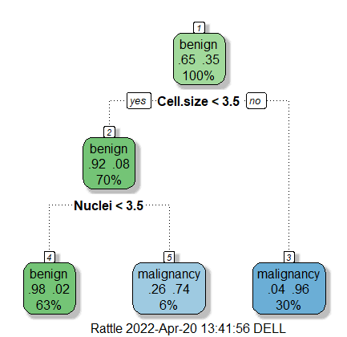
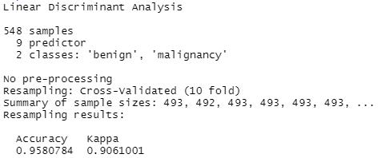
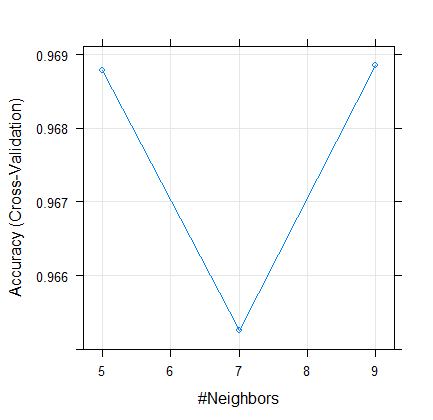
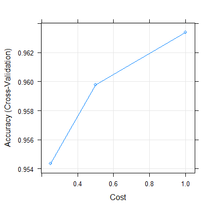
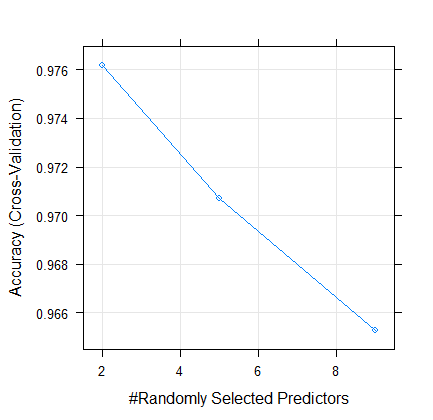
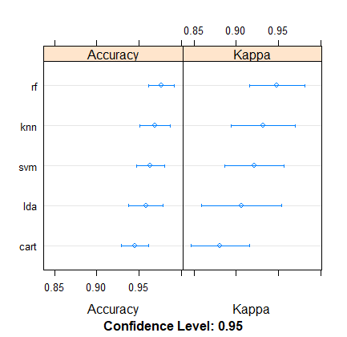

# Breast Cancer Diagnosis uisng Various Machine Learning Models in R
A comparative analysis of various machine learning models for malignancy detection of breast cancer cells
# Problem Definition
* Breast cancer a major health concern causing abnormality in cells
* Cancer specific to females with an exponential increase of death reports.
* An early diagnose is required for early clinical measures and increase in recovery rate
# Dataset Description
Dataset available in UCI repository, for link [click here](https://archive.ics.uci.edu/ml/index.php)   
Dataset features include:
* Thickness of cell
* Cell size
* Cell shape
* Adhesion
* Single cell size
* Nuclei
* Chromatin
* Nucleoli
* Mitoses
* Group (“Malignancy”, “Benign”)

# ML models Used
### CART (Classification and Regression Trees)

### LDA (Linear discriminant analysis)

### KNN (K Nearest Neighbors)

### SVM (Support Vector Machine)

### RF (Random Forest)

# Comparitive Study Results
After the comparison of various machine learning models. Random Forest displayed highest accuracy.

# Tools used
* R Studio
* Orange tool
* R script
* R markdown
